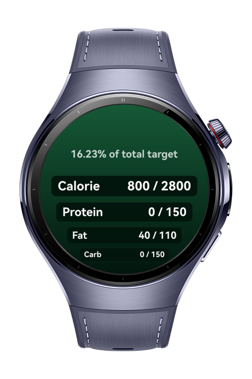
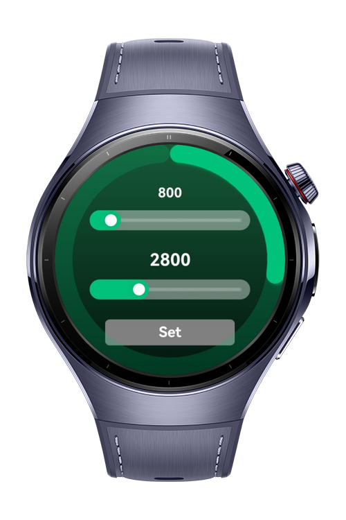
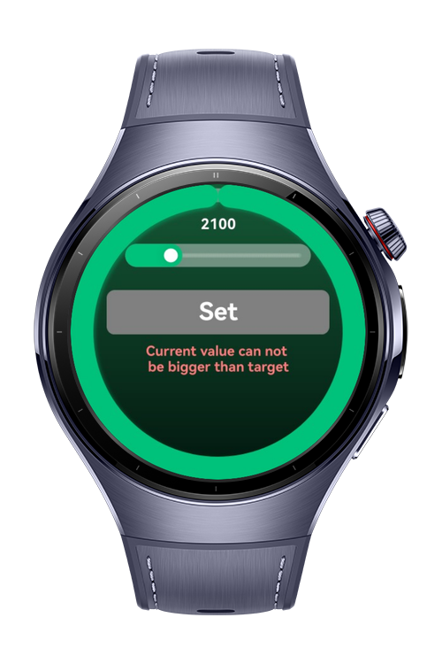

> **Note:** To access all shared projects, get information about environment setup, and view other guides, please visit [Explore-In-HMOS-Wearable Index](https://github.com/Explore-In-HMOS-Wearable/hmos-index).

# Calorie Tracker
A simple app that helps users track their daily intake of calories, protein, fat, and carbs. It calculates individual progress for each macro and provides an average progress score to monitor overall dietary goals.


# Preview

<p align="left">
  
  
  
</p>


# Use Cases

- Tracking of calories, protein, fat, and carbs
- Customizable daily macro targets
- Visual progress indicators for each macro
- Average progress calculation

# Tech Stack

- **Languages**: ArkTS, Typescript
- **Frameworks**: HarmonyOS SDK 5.1.0(18)
- **Tools**: DevEco Studio Vers 5.1.0.842
- **Libraries**: @kit.ArkUI


# Directory Structure

```entry/src/main/ets/
|---core
| |---services
| | |---NavigationService.ets
| | |---TrackerService.ets 
| |---models
| | |---MacroModel.ets
|---entryability
| |---EntryAbility.ets
|---entrybackupability
| |---EntryBackupAbility.ets  
|---pages
| |---HomePage.ets
| |---Index.ets
| |---SetMacroPage.ets

```

# Constraints and Restrictions
## Supported Devices
- Huawei Watch 5

# LICENSE

CalorieTracker is distributed under the terms of the MIT License.
See the [LICENSE](/LICENSE) for more information.
